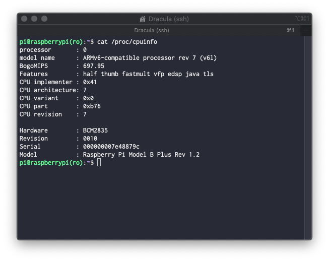

# raspberry-ro
 RaspberryPi in Read-Only mode

<p align="center">
  
</p>

The life of micro SD cards can be drastically reduced when there are excess writes due to intensive use, likewise, the failures in the power supply can increase the chances of failure in the reading of data.

For example, if you want to use the Pi-hole and the RaspberryPi to block advertisements, this combination can accelerate the degradation of the micro SD card. However, the problem can be mitigated with the correct configuration of the filesystem in read-mode.

## Automated Configuration Step 1

Clone this repo to your RaspberryPi and execute `raspberry_ro_rw.sh` as `root` user, this is the fastest way to configure the RaspberryPi in read-mode.

```bash
$ git clone --depth 1 https://github.com/elulcao/raspberry-ro raspberry-ro
$ cd raspberry-ro
$ sudo su
# bash raspberry_ro_rw.sh
```

If your RaspberryPi does not have git installed yet, you will have to clone the repository to a different computer to later propagate all the files to the RaspberryPi, for example via SSH. Once the files have been copied, run the `raspberry_ro_rw.sh` on the RaspberryPi.

In the following example, the IP assigned is `192.168.1.63`, which may vary according to the ISP provider and the hardware provided to access the Internet.

```bash
$ git clone --depth 1 https://github.com/elulcao/raspberry-ro raspberry-ro
$ scp -r /raspberry_ro_rw pi@192.168.1.63:/home/pi
$ ssh pi@192.168.1.63
$ cd raspberry-ro
$ sudo su
# bash raspberry_ro_rw.sh
```

Once the configuration is finished, restart the RaspberryPi to later continue with the installation and configuration of Pi-hole. If everything has gone well, it will be observed that the RaspberryPi now shows `ro` at the bash prompt. which indicates that the file system is in Read-Only mode. To switch to writing mode, and to be able to install other applications, just type in the console `rw`; Read-Write.

```bash
pi@raspberrypi(ro):~$ rw
pi@raspberrypi(rw):~$ curl -sSL https://install.pi-hole.net | bash
```

## Automated Configuration Step 2
After configuring Pi-hole, proceed to execute the following script `extras_ro_rw.sh` to finish configuring the RaspberryPi in read mode.

## References

[The Pi-hole](https://pi-hole.net/)

[Charles's blog](https://hallard.me/raspberry-pi-read-only/)

[raspberrypi.org](https://www.raspberrypi.org/forums/viewtopic.php?f=37&t=63996)